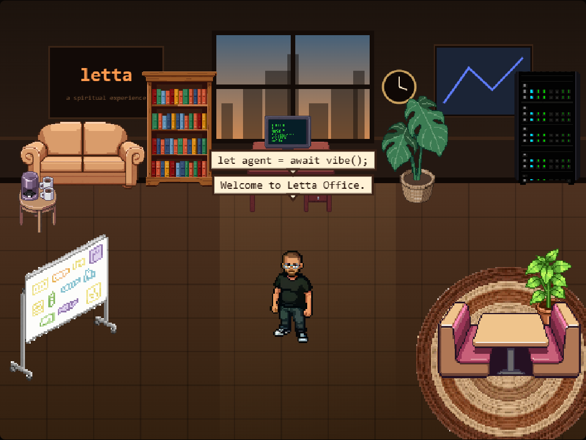
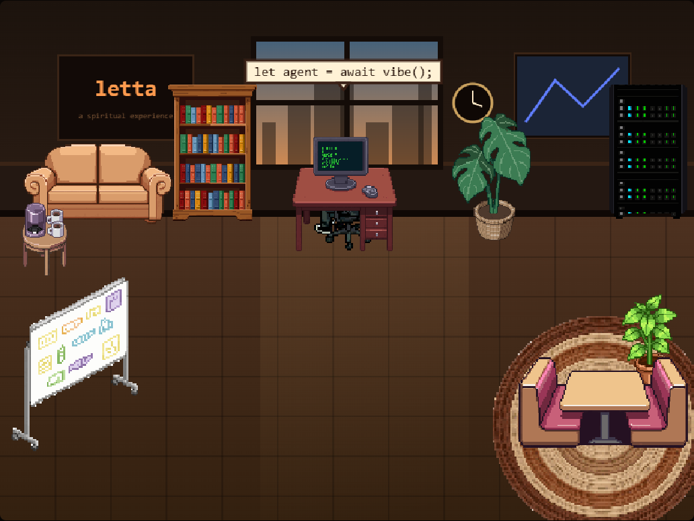

# Letta Office

A tiny pixel office for the [Letta](https://www.letta.com) Code CLI. It opens a browser window with a cozy, furnished office, and a little pixel developer lives inside it, acting out whatever your agent is doing in real time. He sits down at his desk to type when the agent edits or runs a command, wanders off to read, steps up to the whiteboard to present, heads to the booth for a meeting, and frets when a tool errors.



It is a Letta Code mod. The mod runs a small local server, streams harness activity to the page over Server-Sent Events, and the page renders the office on a canvas. Nothing leaves your machine: the server binds to localhost and serves only the mod's own files.

## What the pixel dev does

| Agent activity | In the office |
|---|---|
| Thinking (new turn) | stands in the middle of the room |
| Editing / writing | sits at the desk and types |
| Running a command | at the desk terminal |
| Reading / searching | walks over to read |
| Planning | presents at the whiteboard |
| Delegating a sub-agent | heads to the meeting booth |
| Web request | over by the window |
| A tool errors | a flustered "uh oh" |
| Quiet stretch | settles back, idle |

He is depth-sorted against the furniture, so he passes in front of some pieces and behind others, and he routes around furniture instead of walking over it.



## Install

1. Copy the mod into your Letta mods folder:
   - `mods/letta-ofiice.mjs` goes to `~/.letta/mods/letta-ofiice.mjs`
2. Copy the office folder to your Documents:
   - the `Letta-Ofiice/` folder goes to `~/Documents/Letta-Ofiice/`
   - (or put it anywhere and set the `LETTA_OFIICE_ROOT` environment variable to that path)
3. In Letta Code, reload and open it:
   ```
   /reload
   /office
   ```

## Commands

- `/office` (or `/ofiice`) opens the office window.
- `/office browser` opens it as a normal browser tab.
- `/office status` prints the local URL without opening a window.
- `/office stop` closes the local server.

## Agents can forge their own body

The default pixel developer is Cameron, but the mod registers agent-callable tools so your agent can design its own avatar and move into the office wearing it. The agent writes a visual description of itself, [PixelLab](https://www.pixellab.ai) generates an 8-direction character with a walking animation (plus desk-sitting and whiteboard-presenting poses), and the office switches to the new body live, no refresh needed. Sprites are downloaded into `Letta-Ofiice/assets/characters/<name>/` at install, so they are yours permanently.

| Tool | What it does |
|---|---|
| `office_new_character` | Forge a new avatar from a self-description (runs in the background, 5-15 min, ~10-30 PixelLab generations) |
| `office_character_status` | Check forge progress and list installed characters |
| `office_adopt_character` | Install a character you already made with the [PixelLab MCP server](https://github.com/pixellab-code/pixellab-mcp) or web UI (free, download only) |
| `office_use_character` | Switch the active avatar (Cameron is always available) |

Setup: the forge needs a [PixelLab API token](https://www.pixellab.ai/pixellab-api). Give it to the mod one of three ways:

- a `PIXELLAB_SECRET` agent secret in Letta Code (recommended)
- a `PIXELLAB_SECRET` or `PIXELLAB_TOKEN` environment variable
- a `pixellab.json` file next to the office assets: `{ "token": "..." }`

Then just ask your agent something like *"design yourself a body and move into the office"*. Descriptions work best when they are concrete and color-blocked (build, hair, clothing and their colors); pixel art at this size cannot render moods or lighting. Creating a character costs PixelLab generations, so the create tool asks for approval; status checks, adopting an existing character, and switching avatars are free and unprompted.

## How it works

- The mod (`letta-ofiice.mjs`) hooks Letta Code lifecycle, turn, and tool events, maps each one to a station (desk, shelf, whiteboard, terminal, booth, and so on), and broadcasts the current state to the page over `/events` using Server-Sent Events.
- The page (`office.js`) draws the room and furniture as separate sprites on a canvas, depth-sorts the developer among them, and moves him to the matching station with a short walk animation. It falls back to a self-running demo loop when opened on its own with no agent driving it.
- Only a coarse station and a short canned status line ever reach the page. No model reasoning is forwarded.

## Rearranging the office

The furniture layout is baked into the code (`CONFIG.props` in `office.js`), so every install starts the same. To rearrange it yourself, open `office.js`, change `editable: false` to `editable: true`, refresh, then:

- press `E` to toggle edit mode
- click a piece and drag to move it, arrow keys to nudge, `+` / `-` to resize
- press `S` to copy the layout, then paste the new positions into `CONFIG.props`

Set `editable` back to `false` when you are done.

## Credits

- Built by Marta Varen.
- The mod harness (local server, event hooks, activity mapping) was built together with Sam, a Letta agent.
- Pixel art generated with [PixelLab](https://www.pixellab.ai).
- Inspired by the lovely [pixel-agents](https://marketplace.visualstudio.com/items?itemName=pablodelucca.pixel-agents) VS Code extension.
- Made with affection for the Letta team. The pixel developer is a friendly homage, not an official likeness.

## License

MIT. See [LICENSE](LICENSE).
